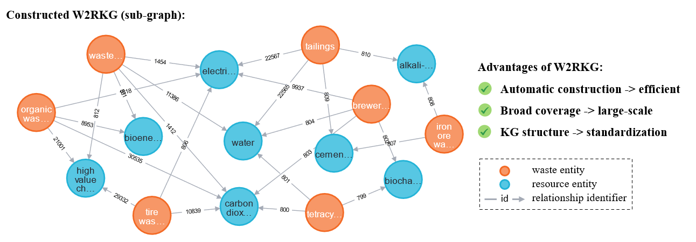

## Waste-to-resource KG construction




W2RKG data in [`W2RKG`](W2RKG) folder of this repository.

### Dependencies

Operating System: Windows 11
CUDA version: 12.6
GPU: NVIDIA GeForce RTX 4070

Software:
```
Ollama 0.11.7
Neo4j Desktop 1.5.9
```

Python packages:
```
ollama 0.3.3
openai 1.95.1
pandas 2.1.3
torch 2.1.0+cu121
sentence-transformers 3.1.1
langchain 0.3.0
numpy 1.26.2
scipy 1.11.4
scikit-learn 1.1.3
```

All software and packages can be installed within minutes.

### Extract W2R from abstracts

Experiment with different models, prompts, and styles.
- model: llama3.1, gpt-4o-mini
- prompt: zero, few, cot
- style: json, code1, code2

Result automatically saved at "args.save_dir/{model}_{prompt}_{style}" (zero-shot) or "args.save_dir/{model}_{prompt}_{style}_k{shot_k}" (few-shot) folder.

Output three files:
- **w2r_results.json**
- **w2r_invalid.txt**        (to check errors)
- **w2r_invalid_doi.txt**    (record the doi of the abstract that does not produce valid w2r)
- **extraction_log.log**     (record the running process)

Example of usage:

For obtaining results for extraction performance evaluation:
```sh
python extract_W2R_compare.py --num 50 --model gpt-4o-mini --prompt zero --style code --save_dir baseline_evaluation --repeat 5
```

For obtaining results for constructing the final database:
```sh
python extract_W2R_compare.py --num -1 --model gpt-4o-mini --prompt zero --style code --save_dir --results_all/abstract
```

Expected time to process 1 abstract: <1 second using local LLaMa 3.1 model, <0.2 second using OpenAI API.

### Evaluation with ground-truth

For each output (w2r_results.json), compare it with the ground-truth file and save metrics result.

Results are saved at the same folder as w2r_results.json by default. There are three output files:
- **metrics.csv**  (store the micro/macro precision, recall, f1, and Jaccard)
- **metrics_intermediate.json**  (store the TP, FP, FN, Jaccard for 50 papers as a dict)
- **prediction_resolution.csv**  (store the mapping between predicted and ground-truth entities)
- **extraction_evaluation_with_gt_result.log**    (store the details and final evaluation result)

Example of usage for a single W2R csv file:
```sh
python evaluation_with_gt.py --model gpt-4o-mini --pr_file result_temp/w2r_resutls.json
```

Example of usage for multiple results from multiple runs (assume subfolders are "run1", "run2", ...):
```sh
python evaluation_with_gt.py --model gpt-4o-mini --pr_folder extraction_evaluation/llama3.1_zero_json
``` 

### Extract W2R from fulltext

After settling on the best model-prompt-style, extract from fulltext.
- model: llama3.1, gpt-4o-mini
- method: full, chunk
- style: json, code1 (no code2)

Output:
- **reivew_papars/w2r_fulltext_results_{rowID}.json**
- **extraction_log.log**     (record the running process)

Example of usage:
```sh
python extract_W2R_fulltext.py --num -1 --model gpt-4o-mini --model_relatedness gpt-4o-mini --chunk_size 1000 --save_dir results_all/fulltext
```

Expected time to process fulltext of one paper: 30-60 seconds using local LLaMa3.1 model, <10 seconds using OpenAI API.

### Merge results from abstracts and fulltext

Output files:
- **all_w2r_list.json**      (store all W2R sets, only for those waste and resource are not empty)
- **all_resource_list.txt**
- **all_waste_list.txt**

Remember to set file paths in the script. Output files are saved in "result_all/before_fusion" folder by default.

Example of usage:
```sh
python merge_results.py
```

### Fusion
After extracting from abstracts and fulltext, fuse the triples.

Output files:
- **waste_cluster_elements.json**
- **resource_cluster_elements.json**
- **waste_cluster_unified_names.json**
- **resource_cluster_unified_names.json**
- **fusion_log.log**                 (record the running process)
- **fused_triples.json**             (store the fused triples)
- **fused_triples_aggregated.json**  (store the aggregated fused triples, combining same waste-resource pairs)

Example of usage:
```sh
python fusion_triples.py --input_file results_all/before_fusion/all_w2r_list.json --save_path results_all/after_fusion/thre08_complete --waste_threshold 0.8 --resource_threshold 0.8 --model_unify_names gpt-4o-mini
```

### Write to database

Write the fused triples to Neo4j. Remember to change input file and the password.
```sh
python write_database.py
```

-----------------------------

### Fine-tune LLaMa 3.1 model

The fine-tuning was conducted on Golab platform with T4 GPU, using Low-Rank Adaptation method.
The two scripts `finetune_llama/extraction_llama_finetune.ipynb` (JSON-style)
and `finetune_llama/extraction_llama_finetune_codestyle.ipynb` (code-style)
contain codes for model fine-tuning and inference.

The fine-tuned LoRa weights can be accessed via this [GDrive link](https://drive.google.com/drive/folders/12yNoSqhExA3EG_Tusa-xfU1Dwm4L_Dvy?usp=sharing).